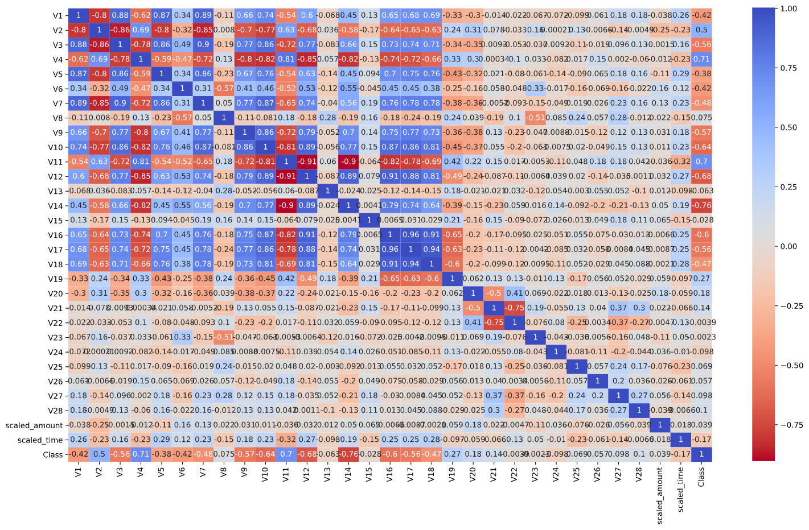
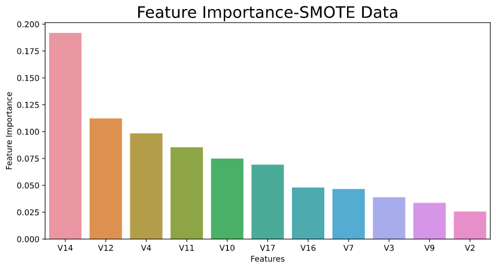
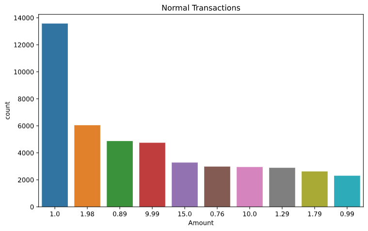

# Credit Card Fraud

## Problem Statement

To understand the features and gather insights to identify the fraud transactions.We ll be performing oversampling using SMOTE to balance the data

## Data source

Used data from Kaggle(https://www.kaggle.com/mlg-ulb/creditcardfraud)

## Data Description

This dataset contains only numerical input variables which are the result of a PCA transformation. Due to confidentiality issues, we cannot provide the original features and more background information about the data. Features V1, V2, … V28 are the principal components obtained with PCA, the only features which have not been transformed with PCA are 'Time' and 'Amount'. Feature 'Time' contains the seconds elapsed between each transaction and the first transaction in the dataset. The feature 'Amount' is the transaction Amount. Feature 'Class' is the response variable and it takes value 1 in case of fraud and 0 otherwise.

## Graphs

# Conclusion

we are going to evaluate model based on Recall and precision scores.

Recall – Out of all actual frauds how many frauds my model predicted correctly i.e True positive / (True positive + False Negative ).

Precision - Out of all predicted frauds how many frauds my model predicted correctly i.e True Positive / (True positive + False Positive)

Since our Logistic Regression model has the highest recall score (0.955) compared to other models it is best in predict the fraud transaction but it has poor precision score (0.078).In terms of maintaining good recall score ( 0.87) and precision score ( 0.73) the Random Forest model performs better than Logistic Regression
